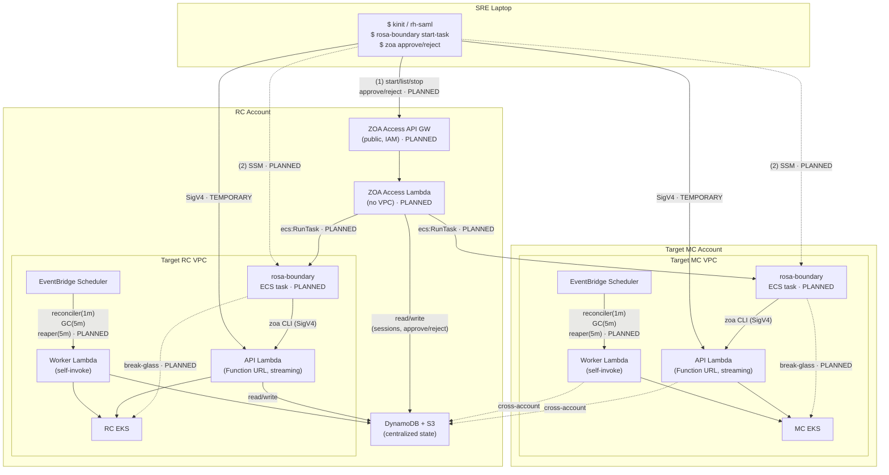

# ROSA Hyperfleet ZOA

A **serverless** Zero Operator Access implementation for the ROSA HCP Hyperfleet platform.

## Overview

ZOA ensures that operators have **no persistent, interactive, or unaudited access** to customer infrastructure. All operational actions are executed through pre-defined, audited **Trusted Actions (TAs)** via a fully serverless execution engine (Lambda, DynamoDB, S3, EventBridge).

This repository is the single source of truth for ZOA: the API server, execution engine, CLI, Trusted Action implementations, and conformance test suite.

## Components

| Component | Binary | Runs on | Purpose |
|-----------|--------|---------|---------|
| CLI | `zoa` | SRE laptop | Operator interface — dispatch, monitor, approve |
| API Lambda | `zoa-lambda` | AWS Lambda (per VPC) | HTTP handler, sync TA execution, native streaming |
| Worker Lambda | `zoa-lambda` | AWS Lambda (per VPC) | Reconciler, GC, async/approved TA dispatch |
| Async Runner | `zoa-runner` | K8s Job (target EKS) | Executes async TAs in-process, uploads artifacts to S3 |
| Trusted Actions | — | Compiled into `zoa-lambda` + `zoa-runner` | Go implementations in `pkg/actions/` |

`zoa-lambda` is a single binary deployed as two Lambda functions differentiated by `HANDLER_MODE` env var (`api` or `worker`). Both binaries (`zoa-lambda` and `zoa-runner`) compile in the full TA registry.

### Key Properties

- **Zero standing access** — no kubectl, kubeconfig, or direct cluster access for operators
- **SRE muscle memory** — CLI mirrors kubectl/aws-cli conventions (`-n`, `-o json`, `-A`, `--force`) so operators are productive in seconds
- **Per-execution RBAC** — each dispatch creates a scoped ServiceAccount + Role, destroyed on completion
- **Direct Lambda-to-EKS** — Lambda connects directly to the EKS API server in the same VPC
- **Immutable audit trail** — caller identity (AWS ARN), target, action, jira, duration; 365-day retention
- **Write cooldown** — rate-limited per target to prevent cascading changes; bypassable with `--force`
- **Max concurrent** — limits active executions per target (all modes); bypassable with `--force`
- **HCP namespace protection** — secrets in customer namespaces (`clusters-*`, `ocm-*`) are blocked
- **FedRAMP-ready** — KMS encryption at rest, PITR with 35-day backups, deletion protection

### Why Serverless

The entire ZOA data path — from CLI invocation to TA execution — uses only managed AWS services with no persistent compute:

- **Zero patching surface** — no OS, runtime, or middleware to maintain
- **Per-invocation cost** — zero cost when operators aren't running TAs
- **Failure domain isolation** — each VPC has its own Lambda pair; a failure in one cluster's ZOA cannot cascade to another
- **No capacity planning** — Lambda scales to concurrent limit automatically; DynamoDB on-demand handles any write pattern

### Failure Domains

**Sync (auto-approved) — the common case:**

| Component | SLA | On failure |
|-----------|-----|------------|
| AWS Lambda (per VPC) | 99.95% | That cluster's TAs unavailable; other clusters unaffected |
| DynamoDB | 99.999% | Cannot dispatch — execution record required before execution |
| EKS API server | 99.95% | TA fails; Lambda responds with error + execution logs inline |

Output is returned **inline in the HTTP response**. S3 archival happens best-effort for long-term retention — if S3 is down, the operator still gets output immediately.

**Async and manual-approval paths** (adds to the above):

| Component | SLA | Required by | On failure |
|-----------|-----|-------------|------------|
| S3 + KMS | 99.99% | Async (runner uploads output) | Execution marked failed |
| EventBridge Scheduler | 99.99% | Async + manual-approval (triggers reconciler/GC) | Worker Lambda not invoked; approved TAs stuck |

Composite sync availability: **99.95%** (~22 min/month downtime budget, bottlenecked by Lambda + EKS). Lambdas deploy per-VPC to isolate failure domains — one cluster's ZOA outage cannot cascade to another.

## Architecture

ZOA deploys **two Lambda functions per target VPC** (one per EKS cluster). Both use the same container image differentiated by `HANDLER_MODE`:

- **API Lambda** — Function URL with IAM auth (invoke mode: `RESPONSE_STREAM`). Handles HTTP requests from the CLI and executes sync TAs directly.
- **Worker Lambda** — EventBridge-triggered (invoke mode: `BUFFERED`). Runs the reconciler (1m), GC (5m), and TA execution for approved workflows (sync or async) via self-invocation.

The split exists because Lambda timeout, concurrency, and invocation mode (streaming vs standard) are per-function settings.



> **Note:** Components marked `· PLANNED` are part of the target architecture but not yet implemented. Today, the CLI calls API Lambda Function URLs directly via SigV4 (`TEMPORARY` path). Target state: CLI → ZOA Access → rosa-boundary (ECS + SSM) → local API Lambda.

### Execution Modes

All modes persist execution state in DynamoDB before dispatch.

| Mode | Approval | Flow |
|------|----------|------|
| **Sync, auto** | None | CLI → API Lambda → execute in-process → output returned inline in HTTP response |
| **Async, auto** | None | CLI → API Lambda → create Job → reconciler polls → output fetched from S3 |
| **Sync, manual** | Required | CLI → API Lambda → pending → approve → reconciler → execute → inline · *PLANNED* |
| **Async, manual** | Required | CLI → API Lambda → pending → approve → reconciler → create Job · *PLANNED* |

**Sync output delivery**: the API response contains the TA output (on success) or execution logs (on failure) directly — no second HTTP call or S3 fetch required. S3 archival happens asynchronously for long-term retention.

**Async output delivery**: `zoa-runner` uploads output/logs to S3 after Job completion. The CLI fetches via `GET /runs/{id}?include=output`.

For details on K8s resources and the streaming architecture, see [Implementation Details](docs/architecture/implementation.md).

## Container Images

| Image | Containerfile | Contents | Purpose |
|-------|---------------|----------|---------|
| `zoa-lambda` | `Containerfile` | `zoa-lambda` binary (UBI-minimal) | Deployed as Lambda function (API + Worker modes) |
| `zoa-runner` | `Containerfile.runner` | `zoa-runner` + `zoa` CLI | Runs inside K8s Jobs for async TA execution |

## Install the CLI

See [CLI Reference — Install](docs/cli-reference.md#install) for download
instructions and checksum verification.

To build from source: `make build` (requires Go 1.26+).

## Quick Start

```bash
make all                           # fmt → vet → lint → test → build
export ZOA_API_URL="https://<id>.lambda-url.<region>.on.aws"
./bin/zoa version                  # Verify connectivity
./bin/zoa actions                  # List available TAs
./bin/zoa run get_resource --jira OSD-123 --namespace kube-system --resource pods
./hack/demo-cli.sh                 # Full capability walkthrough (--step for interactive)
```

## Repository Structure

```
rosa-hyperfleet-zoa/
├── cmd/
│   ├── zoa/              CLI binary
│   ├── zoa-lambda/       Lambda function (api + worker modes)
│   └── zoa-runner/       Async Job runner (K8s Job entrypoint)
├── internal/
│   ├── cli/              Cobra commands + APIClient interface
│   ├── client/           SigV4-signed HTTP client
│   ├── output/           Table + JSON formatting
│   └── eksauth/          EKS token generation
├── pkg/
│   ├── actions/          TA framework, registry, and implementations
│   ├── api/              HTTP route handlers
│   ├── handler/          Lambda event router
│   ├── executor/         K8s SA/RBAC creation, sync/async execution
│   ├── store/            DynamoDB persistence interfaces
│   ├── scheduler/        Reconciler, GC (EventBridge-triggered)
│   ├── config/           Env-var configuration
│   └── metrics/          CloudWatch EMF emission
├── test/e2e/             E2E Ginkgo suite (deep + smoke)
├── ci/                   CI scripts (lint, test, verify)
├── docs/                 Documentation
├── Containerfile         Lambda image (api + worker)
├── Containerfile.runner  Runner image (async K8s Jobs)
└── Makefile
```

## Documentation

| Document | Description |
|----------|-------------|
| [API Reference](docs/api-reference.md) | HTTP endpoints, request/response formats |
| [CLI Reference](docs/cli-reference.md) | Commands, flags, examples |
| [Trusted Actions Guide](docs/trusted-actions.md) | How to author new TAs in Go |
| [Development Guide](docs/development.md) | Build, test, lint, CI |
| [End-to-End Testing](docs/e2e-testing.md) | Deep/smoke test tiers, running locally against dev/CI environments, CI image injection |
| [Konflux](docs/konflux.md) | Production image build pipelines, Quay repos |
| [Lambda Model](docs/architecture/lambda-model.md) | Lambda functions, concurrency, and rationale |
| [Timeout Tuning](docs/architecture/timeout-tuning.md) | Timeout layers and adjustment procedures |
| [Implementation Details](docs/architecture/implementation.md) | Execution flows, env vars, safety controls |

## Testing

```bash
make test                          # Unit tests with race detection
make test-e2e                      # E2E deep suite (needs ZOA_RC_API_URL / ZOA_MC_API_URL)
make test-e2e-smoke                # E2E smoke subset (~2min)
```

Two conformance gates ensure every Trusted Action stays tested:

- **Unit conformance** (`pkg/actions/conformance_test.go`, runs on every PR via `make test`):
  required metadata, naming conventions, scope-RBAC consistency, write-TA safety rules, timeout
  ceiling compliance, parameter uniqueness, and unit test file existence.
- **E2E conformance** (`test/e2e/conformance_test.go`, runs on every `make test-e2e`):
  queries the live Lambda registry, verifies every registered TA has a `ta_*` e2e test file,
  checks `knownActions` matches the live registry, and ensures smoke tests cover both `kube-api`
  and `aws-api` scopes.

## Infrastructure

ZOA infrastructure (Terraform) lives in [rosa-hyperfleet](https://github.com/openshift-online/rosa-hyperfleet):

- `terraform/modules/zoa/` — DynamoDB tables, S3 bucket, KMS key, ECR
- `terraform/modules/zoa-lambda/` — Per-VPC Lambda functions, IAM, EventBridge, EKS access
- [ZOA Architecture ADR](https://github.com/openshift-online/rosa-hyperfleet/blob/main/docs/design/zoa-architecture.md) — infrastructure architecture, Terraform context, and platform integration
