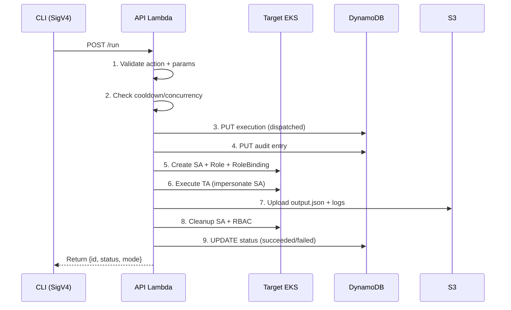
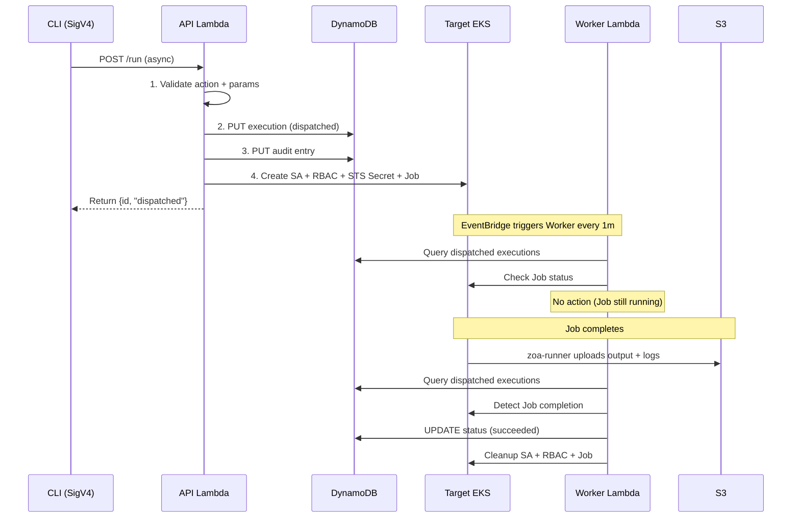
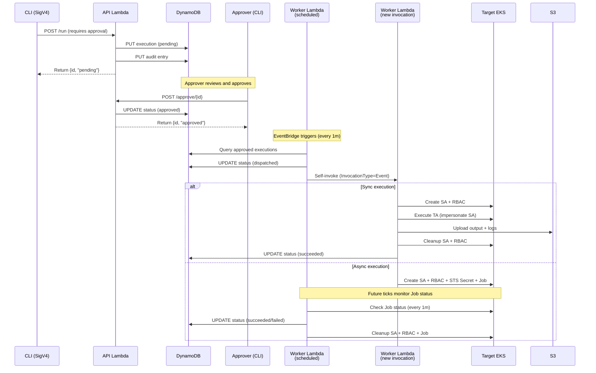

# Lambda Architecture — Implementation Details

This document covers internal implementation details of the ZOA Lambda execution engine. For the high-level architecture, see [Lambda Model](lambda-model.md).

## Execution Flow (Sync)

## Execution Flow (Async)

## Execution Flow (Manual Approval · PLANNED)

## What Gets Created

**Sync** — ephemeral K8s resources created and destroyed within a single Lambda invocation:
- ServiceAccount + Role + RoleBinding (scoped RBAC from TA metadata)
- TA executes via SA impersonation (K8s audit logs show only the declared RBAC)
- Output uploaded to S3, status updated in DynamoDB, all resources cleaned up before responding

**Async** — a K8s Job with separated execution and upload permissions:
- ServiceAccount + Role + RoleBinding (K8s RBAC for TA execution only)
- STS Secret with scoped session credentials (S3 upload only, restricted to execution prefix via session policy)
- Job runs `zoa-runner` which executes the TA and uploads output to S3
- No output size limit — writes directly to S3 without Lambda response constraints
- Clean permission separation: SA in K8s audit logs has only TA-declared RBAC; S3 upload uses a separate STS credential with no K8s permissions — no need for two containers or intermediate storage

## Response Streaming

Standard Lambda response body is limited to 6MB. Native Go streaming (`LambdaFunctionURLStreamingResponse` from `aws-lambda-go`) with `RESPONSE_STREAM` invoke mode on the Function URL enables streamed responses up to 200MB (first 6MB uncapped, remainder at 2MBps). This limit applies equally to sync outputs (returned inline) and async outputs (proxied from S3 via `zoa download`) — both are served through the API Lambda response. The streaming adapter lives in `pkg/lambdahttp/` and converts Function URL events to `net/http` requests served by the standard Go handler.

## Package Responsibilities

### `pkg/actions` — Trusted Action Registry

Defines the `Action` interface (`Metadata`, `Validate`, `Execute`) and a global in-memory registry. Each TA is a standalone Go type that self-registers at init-time. The package also provides:
- `ActionMetadata` — declarative TA manifest (scope, type, RBAC, parameters, timeouts, cooldown, dry-run link)
- `RBACConfig` / `RBACRule` — per-TA Kubernetes RBAC expressed as code, used by the executor to create Role/ClusterRole
- `ValidateRequiredParams` / `ApplyDefaults` — shared validation helpers so TAs don't repeat boilerplate
- Conformance tests verifying structural invariants across all registered TAs (scope validity, RBAC presence, parameter definitions)

### `pkg/lambdahttp` — Function URL Streaming Adapter

Converts AWS Lambda Function URL events (`events.LambdaFunctionURLRequest`) into standard `*http.Request` objects and serves them through the Go `http.Handler` interface. Returns a `LambdaFunctionURLStreamingResponse` (io.Reader body) enabling native response streaming up to 200MB. This decouples all HTTP handler logic from the Lambda runtime — the rest of the codebase is pure `net/http`.

### `pkg/metrics` — CloudWatch EMF Instrumentation

Emits [Embedded Metric Format](https://docs.aws.amazon.com/AmazonCloudWatch/latest/monitoring/CloudWatch_Embedded_Metric_Format.html) structured JSON to stdout, which CloudWatch Logs automatically parses into CloudWatch Metrics (scraped by YACE into Prometheus for alerting). Provides:
- `Emit()` — writes a single EMF log line with arbitrary dimensions and metric values
- `HTTPMetrics()` — middleware that wraps `http.Handler` and emits `RequestDuration`, `RequestCount`, and `ServerErrors` per request
- Type-safe metric constructors: `Count`, `Milliseconds`, `Seconds`, `Bytes`

### `pkg/api` — HTTP Handlers

Routes incoming HTTP requests to the appropriate handler. Uses Go 1.22+ `net/http` ServeMux with method-based routing.

### `pkg/handler` — Lambda Event Router

The unified Lambda entry point. Routes events by structure:
- `requestContext` present → HTTP event (API mode)
- `route` = `execute` → self-invoked TA execution (Worker mode)
- `route` = `reconciler`/`gc` → scheduled event (Worker mode)

### `pkg/executor` — Execution Engine

Differentiates by action scope:

**kube-api scope:**
1. Ensure `zoa-jobs` namespace exists (idempotent)
2. Create per-execution ServiceAccount (labeled for GC)
3. Create Role/ClusterRole + Binding from TA's RBAC metadata
4. Impersonate SA via `rest.ImpersonationConfig`
5. Call `action.Execute()` with scoped client
6. Upload output + logs to S3
7. Cleanup all K8s resources (SA, Role, Binding)

**aws-api scope:**
- Assume the appropriate IAM role (read or write) via STS
- Pass AWS config directly to the action
- No K8s resources created or cleaned up

All K8s resource creation retries with exponential backoff (up to 5 attempts) for transient EKS API errors.

### `pkg/scheduler` — Scheduled Work

- **Reconciler** (1m): Polls for dispatched async executions, checks K8s Job status, transitions to succeeded/failed
- **GC** (5m): Finds orphaned K8s resources in `zoa-jobs` by label, cross-references DynamoDB, deletes stale resources

### `pkg/store` — DynamoDB Persistence

**Executions table:**
- PK: `executionId`
- GSI `account-index`: PK=`accountId`, SK=`createdAt`
- GSI `status-index`: PK=`status`, SK=`createdAt`
- GSI `target-status-index`: PK=`targetCluster#status`, SK=`createdAt`

**Audit table:**
- PK: `accountId`, SK: `timestamp` (nanosecond precision)

### `pkg/config` — Environment Configuration

All configuration via environment variables (Terraform-managed):

| Env Var | Default | Mode | Description |
|---------|---------|------|-------------|
| `HANDLER_MODE` | — | both | `api` or `worker` |
| `EXECUTION_TABLE` | — | both | DynamoDB executions table |
| `AUDIT_TABLE` | — | api | DynamoDB audit table |
| `ARTIFACT_BUCKET` | — | both | S3 bucket for output/logs |
| `TARGET_CLUSTER` | — | both | Target EKS cluster identifier |
| `ZOA_DEPLOYMENT_TARGET` | — | both | ZOA deployment target: `rc` or `mc` (TA registry filter + validation) |
| `EKS_CLUSTER_ENDPOINT` | — | both | EKS API server URL |
| `EKS_CLUSTER_CA` | — | both | Base64-encoded CA certificate |
| `EKS_CLUSTER_NAME` | — | both | Cluster name (for token generation) |
| `JOB_IMAGE` | — | both | Container image for async K8s Jobs |
| `UPLOADER_ROLE_ARN` | — | both | IAM role for S3 upload credentials |
| `AWS_READ_ROLE_ARN` | — | both | IAM role for read AWS TAs |
| `AWS_WRITE_ROLE_ARN` | — | both | IAM role for write AWS TAs |
| `DATA_STORE_ROLE_ARN` | — | mc | Cross-account role for DynamoDB/S3 |
| `EXECUTION_DEADLINE_SECONDS` | 295 | both | Code deadline for TA execution (sync only) |
| `RECONCILER_DEADLINE_SECONDS` | 55 | worker | Code deadline for scheduled routes |
| `MAX_BATCH_PER_TICK` | 30 | worker | Items per scheduled phase |
| `WRITE_COOLDOWN_SECONDS` | 300 | api | Default write cooldown |
| `MAX_CONCURRENT_PER_TARGET` | 10 | api | Max active executions per target |
| `ZOA_JOBS_NAMESPACE` | `zoa-jobs` | both | K8s namespace for execution resources |

## Safety Controls

| Control | Mechanism |
|---------|-----------|
| Write cooldown | DynamoDB query for recent same-action executions on target |
| Max concurrent | Count active (non-terminal) executions per target |
| HCP namespace block | `get_secret` rejects `cluster-*` namespaces |
| Owner reference check | `delete_pod` refuses standalone pods |
| Timeout ceiling | Per-TA timeout bounded by `EXECUTION_DEADLINE_SECONDS` (sync) or `activeDeadlineSeconds` (async) |
| Batch limit | Scheduled phases cap at `MAX_BATCH_PER_TICK` items |
